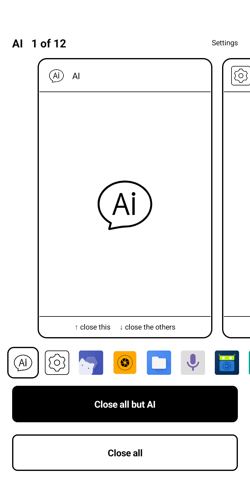
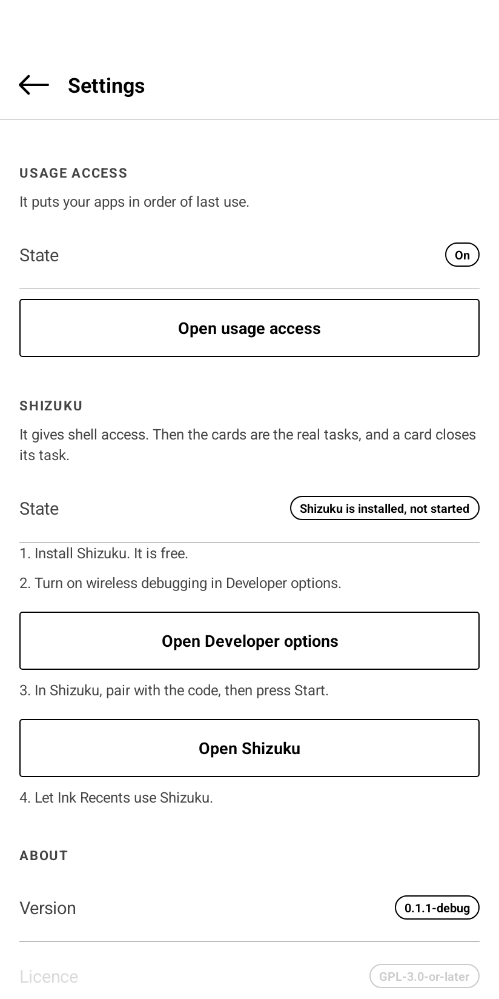

# Ink Recents

A recent-apps switcher drawn for e-ink.

The screen shows one app card at a time. Swipe sideways to go to the next card.
Tap a card to open that app. Swipe a card up to close that app. Swipe a card
down to close all the other apps. Two tall buttons do the same thing with one
tap.

Nothing animates. The row jumps from card to card in one step, because e-ink
shows a moving row as a smear.

Made for e-ink readers (Viwoods, Onyx Boox, Bigme and others) and any
Android 12 or later.

## Screenshots

  
  

The pictures are from a Viwoods AiPaper Reader.

## Install

Download the APK from the Releases page and install it.

The app needs one of the two modes below. Open the app and follow the screen.

## The two modes

Android does not tell an app what is running. So the app works in one of two
ways.

### Usage access

You give the permission in Android settings. The app reads the usage log and
puts your apps in order of last use. A card shows the app icon. "Close" ends
the background processes of the app, and the app leaves the list until you open
it again.

### Shizuku

Shizuku is a separate free app. You start it from the device through wireless
debugging. There is no computer and no root.

With Shizuku the app reads the real task list of the system. A card closes its
task. Where the shell is root, a card also shows the picture that the system
keeps of the task.

The settings screen has the four steps and a button for each one.

## Open the screen from somewhere else

Bind a key to this intent action with a key remapper:

    dev.equwal.inkrecents.OPEN

Example with adb:

    adb shell am start -a dev.equwal.inkrecents.OPEN

There is also a quick settings tile. Its name is "Recent apps". Add it to the
quick settings panel, then tap it.

## Open it with a hardware button

[Rebind](https://github.com/equwal/rebind) remaps the buttons of an e-ink
reader or any Android device. It can put this screen on a button: for example,
a double tap of Power. Rebind is from the same maker.

More extensions: [Awesome Rebind](https://github.com/equwal/awesome-rebind).

## Say thanks

Ink Recents is free and open source. If it made your device better, you can
[buy me a coffee](https://ko-fi.com/truex).

## Build

You need JDK 17 or later and the Android SDK, with platform 36.

    ./gradlew testReleaseUnitTest assembleRelease

The APK is in `app/build/outputs/apk/release/`.

Release signing is optional. Put a `keystore.properties` file in the root of
the project with `storeFile`, `storePassword`, `keyAlias` and `keyPassword`.
Without that file the build makes an unsigned APK.

## More projects

- [SubRead](https://subread.space/): read along with an audiobook, in the browser.
  Also [for Android](https://github.com/equwal/subread-android/releases/latest),
  [for YouTube](https://github.com/equwal/subread-extension/releases/latest)
  and [for KOReader](https://github.com/equwal/subread.koplugin).
- [SubRead Overlay](https://github.com/equwal/subread-overlay/releases/latest): subtitle lines over any Android media player.
- [SubRead Dictionary](https://github.com/equwal/subread-dictionary/releases/latest): a pop-up dictionary for Android that reads Yomitan dictionaries.
- [SubRead Anki](https://github.com/equwal/subread-anki): one tap makes an Anki card from any Android app.
- [Subrep](https://github.com/equwal/subrep-android/releases/latest): live captions of the sound of your phone.
- [Book Simulator](https://booksimulator.com/): a reading room for Aozora Bunko and Project Gutenberg books.
- [honjimaku.com](https://honjimaku.com/): subtitles for Japanese audiobooks.
- [sbm Sync](https://sbmsync.com/): your bookmarks, the same on every device,
  with [sbm](https://github.com/equwal/sbm) for dmenu,
  [sbm for Android](https://github.com/equwal/sbm-android/releases/latest)
  and the [sbm add-on](https://github.com/equwal/sbm-extension/releases/latest) for Firefox and Chrome.
- [Rebind](https://github.com/equwal/rebind/releases): remap the hardware buttons of e-ink readers and Android,
  with [Ink Recents](https://github.com/equwal/ink-recents/releases/latest),
  [Ink Dim](https://github.com/equwal/ink-dim/releases/latest)
  and [Ink Update](https://github.com/equwal/ink-update/releases/latest).
- [dickt.store](https://dickt.store/): language-learning tools, flashcards and web toys.
- [hentaibun.online](https://hentaibun.online/): learn kanbun and kobun.
- [Recently Written](https://recentlywritten.com/): the blog, and a list of [all projects](https://recentlywritten.com/projects.html).

## Licence

GPL-3.0-or-later. See [LICENSE](LICENSE).

Copyright (c) 2026 equwal.
